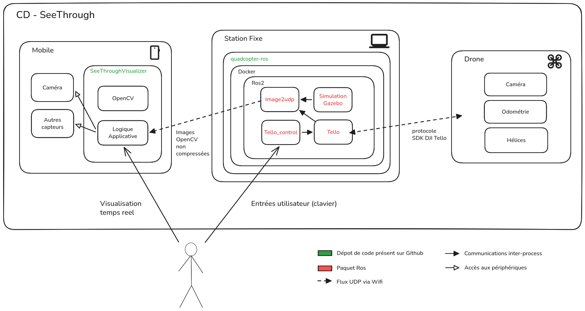

# Architecture

# Usage
Les commandes suivantes supposent un environnement linux.

# 1er lancement

`./launchRos2 build`

# Avant de lancer le container ROS2
`xhost +`
TODO: Find a way to do it in launchRos2
# Lancer le container
`./launchRos2`

Les dépendances (apt, pip) sont gérées dans le Dockerfile a l'aide de l'outil 
Rosdep.
Chaque paquet Ros a sa liste de dépendances dans son package.xml.

# Une fois le container lancé

## Compiler le code ROS2
`colcon build --cmake-args -DBUILD_TESTING=ON`
## Sourcer l'environnement ROS2 produit
`source install/setup.sh`

1 commande Ros = 1 terminal (Le service tourne en background, mais utile pour
les logs)
Donc le fonctionnement standard suppose 3 terminaux, chacun ayant executé:
`./launchRos2`
`source install/setup.sh`

# Simulation
## Lancer la simulation
`ros2 launch ros_gz_bringup X3_wall.launch.py`
## Lancer le service du contrôle du drone avec le clavier
`ros2 run teleop_twist_keyboard teleop_twist_keyboard`
## Lancer le streaming du flux video vers tel
`ros2 launch image2udp simu_parameters_launch.py`

#  DJI Tello
Les commandes suivantes supposent que le drone est connecté en tant qu'access
point, et donc qu'il est accessible a 192.168.10.1 .
Si ce n'est pas le cas, il faut creer/modifier un launch file ROS dans 
src/tello/launch et utiliser ros2 launch au lieu de ros2 run.
## Node de communication avec le drone
`ros2 run tello tello`
## Controler le drone
`ros2 run tello_control tello_control`
T used for takeoff, L to land the drone, F to flip forward, E for emergency
stop, WASD and arrows to control the drone movement.
## Lancer le streaming du flux video vers tel
`ros2 launch image2udp real_parameters_launch.py`

## Changer le mot de passe / ssid du drone
`ros2 topic pub /wifi_config tello_msg/msg/TelloWifiConfig "{ssid: 'pfe_see_through', password: 'pfe_see_through'}" -1`

# Une fois le container fermé
`xhost -`
Pour des raisons de securité

# Liens utiles

[Page du template du projet ROS](https://gazebosim.org/docs/harmonic/ros_gz_project_template_guide/)
Contient des informations detaillées sur les différents éléments de
l'arborescence concernant la simu Gazebo (ros_gz_*)

[Pilote Tello ROS](https://github.com/tentone/tello-ros2)
Explication/usage de tous les paquets tello

[SeeThroughVisualizer](https://github.com/AymericCassard/SeeThroughVisualizer)
Consomme le Flux ROS 
